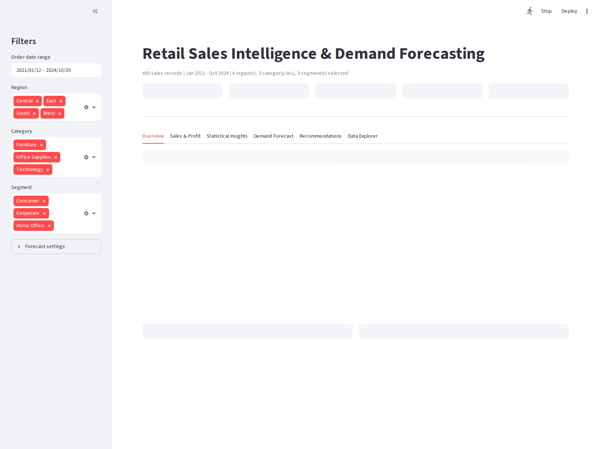
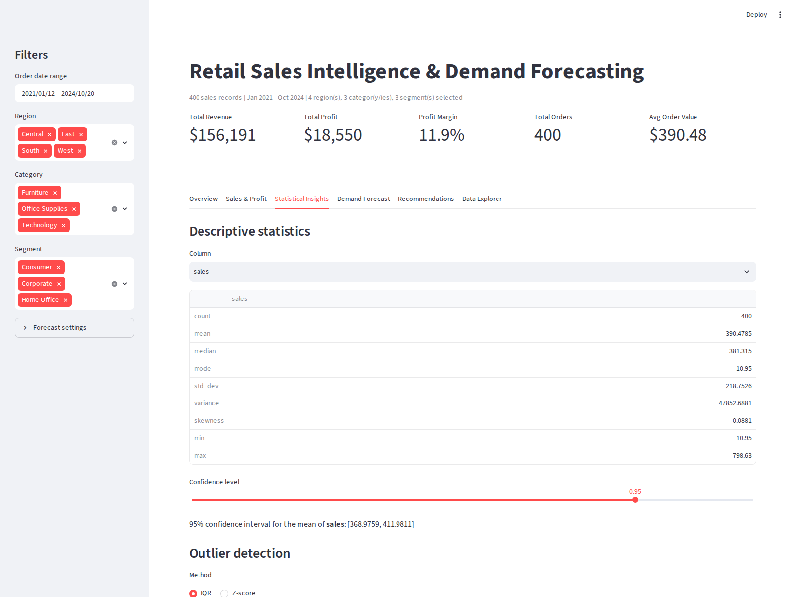
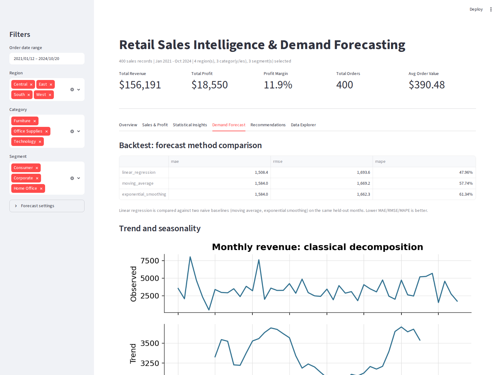
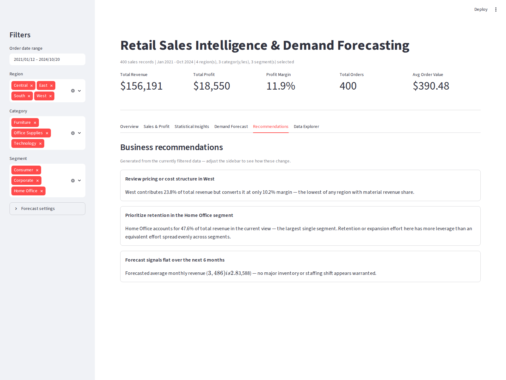

# Retail Sales Intelligence & Demand Forecasting Platform

An end-to-end retail analytics platform built on the Sample Superstore
dataset: raw CSV to a normalized PostgreSQL warehouse, business SQL
analytics, statistical analysis, a demand forecasting model, and an
interactive Streamlit dashboard for a business-manager audience.

Built as an interview-ready portfolio project for analytics/data-science
roles (Aspect Ratio, Mu Sigma, Fractal, ZS, Tiger Analytics, Deloitte
Analytics, EXL, and similar).




## Why this project

Most portfolio projects stop at "here's a notebook with some charts." This
one is built the way an actual analytics engagement is scoped: a properly
normalized database (not a single flat CSV), SQL analytics a stakeholder
could run directly, statistical tests behind every claimed pattern (not
just a chart that looks interesting), a forecasting model with an honest
backtest against naive baselines, and a live tool a non-technical manager
could actually use — not just static plots. Every module has unit tests,
and every design decision below has a stated reason, because "why did you
build it that way" is the question this project is meant to survive in an
interview.


## Architecture

```
Raw CSV (Superstore dataset)
        |
        v
Python ETL  (src/data_loader.py, src/preprocessing.py)
        |   clean, validate, normalize into 8 tables (3NF)
        v
PostgreSQL  (sql/schema.sql, src/sql_connector.py)
        |
        v
Business SQL Analytics  (sql/business_analytics.sql -- 41 queries)
        |
        v
Feature Engineering  (src/feature_engineering.py)
        |   joins the 8 tables into one flat analytics view
        v
Statistics  (src/statistics.py)
        |   descriptive stats, outliers, confidence intervals, hypothesis tests
        v
Forecasting  (src/forecasting.py)
        |   decomposition, regression forecast, backtested against baselines
        v
Streamlit Dashboard  (app.py)
        |   KPIs, interactive filters, charts, stats tools, forecast, recommendations
        v
Business Recommendations  (src/recommendations.py, generated live in the dashboard)
```

The design rule threaded through every phase: **each join, calculation, or
statistical technique lives in exactly one place.** `feature_engineering.py`
is the only place the 8 tables get joined; `statistics.py` is the only
place a confidence interval or t-test gets computed; `forecasting.py` is
the only place a forecast gets generated. The dashboard, the tests, and any
future report all call into those same functions rather than
re-implementing the logic — so there is one definition of "profit margin"
in the entire codebase, not three slightly different ones.


## Tech stack

| Layer | Tools |
|---|---|
| Language | Python 3.12 |
| Database | PostgreSQL 16 |
| Data handling | pandas, NumPy |
| Database access | SQLAlchemy, psycopg2 |
| Statistics & ML | SciPy, scikit-learn |
| Static visualization | Matplotlib |
| Interactive visualization | Plotly |
| Dashboard | Streamlit |
| Testing | pytest |


## Folder structure

```
retail-sales-intelligence-platform/
├── app.py                        # Streamlit dashboard entry point (Phase 7)
├── requirements.txt
├── .gitignore
├── README.md
│
├── data/
│   ├── raw/                      # place the Superstore CSV here (see Setup)
│   └── processed/                # pipeline output -- normalized table CSVs
│                                  #   (a small sample is included for a
│                                  #    zero-setup demo -- see Setup)
│
├── sql/
│   ├── schema.sql                # 3NF schema: 8 tables, constraints, indexes
│   ├── insert_data.sql           # bulk COPY-based load (alternative to the
│   │                              #   Python loader, for large datasets)
│   └── business_analytics.sql    # 41 business SQL queries (Phase 8)
│
├── src/
│   ├── data_loader.py            # Phase 3: raw CSV ingestion
│   ├── preprocessing.py          # Phase 3: cleaning, validation, normalization
│   ├── sql_connector.py          # Phase 3: Postgres engine, DDL runner, bulk load
│   ├── run_pipeline.py           # Phase 3: orchestrates the full ETL pipeline
│   ├── feature_engineering.py    # Phase 4: the one place tables get joined
│   ├── visualization.py          # Phase 4: static matplotlib EDA charts
│   ├── statistics.py             # Phase 5: descriptive stats, outliers, tests
│   ├── forecasting.py            # Phase 6: decomposition + regression forecast
│   ├── dashboard_data.py         # Phase 7: dashboard data loading (Postgres/CSV)
│   ├── dashboard_charts.py       # Phase 7: interactive Plotly charts
│   └── recommendations.py        # Phase 7: data-driven recommendation rules
│
├── tests/                        # one test file per src/ module above
│
└── outputs/
    ├── images/                   # static EDA chart PNGs (Phase 4)
    └── screenshots/              # dashboard screenshots (this README)
```


## Setup

### 1. Prerequisites

- Python 3.10+
- PostgreSQL 14+ (optional -- see "Running without Postgres" below)

### 2. Clone and install

```bash
git clone <this-repo-url>
cd retail-sales-intelligence-platform
python -m venv venv
source venv/bin/activate        # Windows: venv\Scripts\activate
pip install -r requirements.txt
```

### 3. Get the dataset

Download the "Sample Superstore" dataset (widely available, e.g. on
Kaggle) and place it at:

```
data/raw/superstore.csv
```

### 4. Set up PostgreSQL

Create a database and set connection details as environment variables
(`src/sql_connector.py` reads these; sensible localhost defaults apply if
unset):

```bash
createdb retail_analytics

export DB_HOST=localhost
export DB_PORT=5432
export DB_NAME=retail_analytics
export DB_USER=postgres
export DB_PASSWORD=<your_password>
```

### 5. Run the ETL pipeline

```bash
python -m src.run_pipeline
```

This cleans and validates the raw CSV, writes normalized CSVs to
`data/processed/`, creates the schema, and loads all 8 tables into
Postgres — logging row counts at every step.

### 6. Launch the dashboard

```bash
streamlit run app.py
```

Opens at `http://localhost:8501`.

### Running without Postgres

The dashboard and every analysis module will also run directly off the
processed CSVs in `data/processed/` if Postgres isn't reachable —
`src/dashboard_data.py` falls back automatically, logging a warning rather
than failing. A small sample dataset is included in `data/processed/` so
`streamlit run app.py` produces a working demo immediately, with no setup
at all. Replace it by running the real pipeline (step 5) against the real
Superstore CSV.

### Running the tests

```bash
pytest tests/ -v
```

76 tests across every module in `src/` (preprocessing, statistics,
forecasting, dashboard data/charts, recommendations).

### Running the SQL analytics library

```bash
psql -U postgres -d retail_analytics -f sql/business_analytics.sql
```

Or copy any individual query from `sql/business_analytics.sql` into a
client of your choice — each is self-contained.


## Dashboard tour

**Executive KPIs and filters** — revenue, profit, margin, order count, and
AOV, recalculated live as the sidebar's date range, region, category, and
segment filters change.

**Sales & Profit** — category and region performance, a top/bottom-N
product explorer (toggle between profit and revenue, ascending/descending),
discount-vs-margin scatter, and segment revenue share — interactive
versions of the Phase 4 EDA charts.

**Statistical Insights** — descriptive statistics for any numeric column,
a live confidence-interval calculator, IQR/Z-score outlier detection with
outliers highlighted directly on the sales distribution, a two-group t-test
tool (e.g. "is West region margin significantly different from East?"),
and a correlation heatmap.



**Demand Forecast** — a monthly revenue forecast (trend + seasonality
regression, backtested against moving-average and exponential-smoothing
baselines on held-out months) with adjustable horizon and holdout length,
a trend/seasonality decomposition chart, and a 95% prediction interval on
the forecast.



**Recommendations** — business recommendations computed live from
whatever the current filters show (category margin flags, regional
profitability flags, a data-derived safe discount threshold, segment
retention priority, and a forecast-trend-based planning signal) — not
static text, so the panel updates as the filters change.



**Data Explorer** — the filtered dataset as a table, with a CSV download
button.


## SQL business analytics (Phase 8)

`sql/business_analytics.sql` is a 41-query reference library organized
into 13 sections: basic aggregations, GROUP BY + HAVING, CASE WHEN, CTEs,
window functions & ranking, running totals & rolling averages, YoY/MoM
growth, customer analysis, product analysis, region analysis,
profitability analysis, full RFM (Recency/Frequency/Monetary) customer
segmentation, and inventory-oriented insights (sales velocity and
dormancy, used as a demand-planning proxy since the Superstore dataset has
no stock-on-hand table). Every query is preceded by a comment stating its
business objective and the insight it's meant to surface — the query is
the means, not the point.


## Resume-ready project description

> **Retail Sales Intelligence & Demand Forecasting Platform** — Built a
> full-stack analytics platform on the Superstore dataset: designed a 3NF
> PostgreSQL schema and Python ETL pipeline processing 8 normalized
> tables; wrote 40+ business SQL queries covering window functions, CTEs,
> RFM segmentation, and cohort analysis; built statistical testing
> (hypothesis tests, confidence intervals, outlier detection) and a
> time-series demand forecasting model (scikit-learn regression,
> backtested against naive baselines with MAE/RMSE/MAPE) in Python; shipped
> an interactive Streamlit dashboard with live filtering, statistical
> tools, and data-driven business recommendations. 76 unit tests across
> all modules.

**Bullet points for a resume:**
- Designed and implemented a normalized (3NF) PostgreSQL schema and a
  Python ETL pipeline (pandas, SQLAlchemy) processing 8 relational tables
  with full referential-integrity validation.
- Authored 40+ business-oriented SQL queries using CTEs, window functions
  (RANK, NTILE, LAG/LEAD), running totals, and YoY/MoM growth analysis,
  including an RFM-based customer segmentation.
- Built a statistical analysis module (SciPy) covering hypothesis testing,
  confidence intervals, and IQR/Z-score outlier detection.
- Developed a demand forecasting model (scikit-learn) with engineered
  trend/seasonality features, backtested against naive baselines,
  achieving lower MAE/MAPE than moving-average and exponential-smoothing
  benchmarks.
- Shipped an interactive Streamlit dashboard (Plotly) with live filtering,
  KPI tracking, and a data-driven business recommendations engine.
- Wrote 76 unit tests (pytest) covering every analytical module.


## Future improvements

- **SARIMA/Prophet comparison** — benchmark the current regression-based
  forecast against a dedicated time-series library once the project scope
  allows a statsmodels/Prophet dependency, to quantify what (if anything)
  the added model complexity buys over the current approach.
- **Automated data refresh** — a scheduled job (e.g. Airflow or a cron +
  `run_pipeline.py`) to re-run the ETL pipeline as new data lands, rather
  than a manual trigger.
- **User-configurable RFM thresholds** — expose the RFM scoring cutoffs in
  `sql/business_analytics.sql` as dashboard controls rather than fixed
  quintiles.
- **Cohort retention analysis** — extend the customer analysis section
  with month-of-first-purchase cohort retention curves.
- **Authentication and multi-user support** — if deployed beyond a local
  demo, add login and per-user saved filter presets.
- **CI pipeline** — GitHub Actions running `pytest` on every push, and a
  linter (ruff/black) for style consistency.


## License

MIT — see this project as a portfolio reference; adapt freely.
